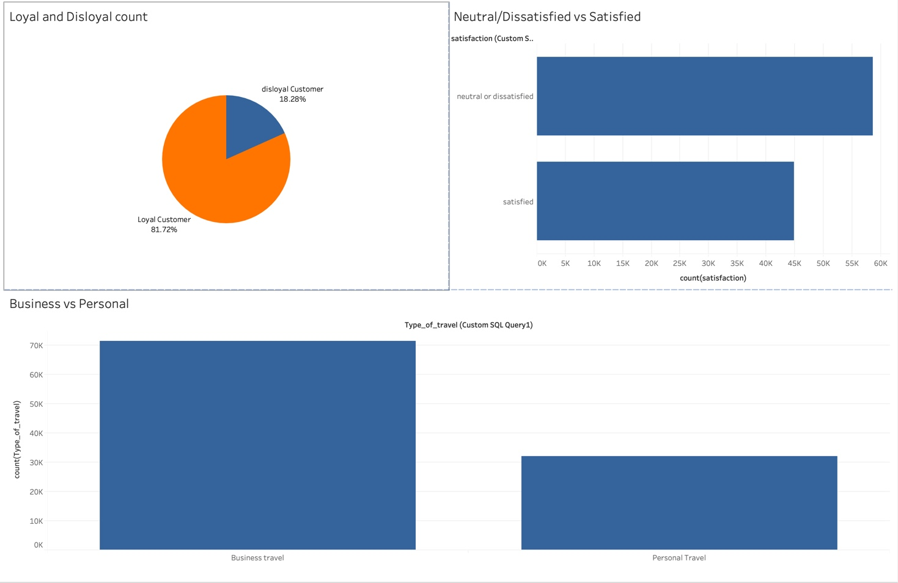
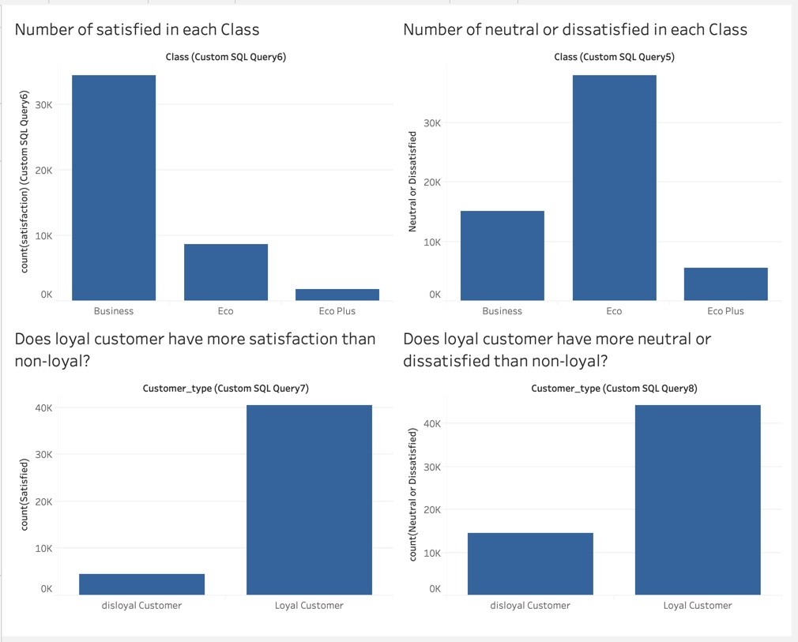

# Airline_sales

This dataset contains an airline passenger satisfaction survey.

# Software used
MySQL workbench, Tableau

# Content
Gender: Gender of the passengers (Female, Male)  
Customer Type: The customer type (Loyal customer, disloyal customer)  
Age: The actual age of the passengers  
Type of Travel: Purpose of the flight of the passengers (Personal Travel, Business Travel)  
Class: Travel class in the plane of the passengers (Business, Eco, Eco Plus)  
Flight distance: The flight distance of this journey  
Inflight wifi service: Satisfaction level of the inflight wifi service (0:Not Applicable;1-5)  
Departure/Arrival time convenient: Satisfaction level of Departure/Arrival time convenient   
Ease of Online booking: Satisfaction level of online booking  
Gate location: Satisfaction level of Gate location  
Food and drink: Satisfaction level of Food and drink  
Online boarding: Satisfaction level of online boarding  
Seat comfort: Satisfaction level of Seat comfort  
Inflight entertainment: Satisfaction level of inflight entertainment  
On-board service: Satisfaction level of On-board service  
Leg room service: Satisfaction level of Leg room service  
Baggage handling: Satisfaction level of baggage handling  
Check-in service: Satisfaction level of Check-in service  
Inflight service: Satisfaction level of inflight service  
Cleanliness: Satisfaction level of Cleanliness  
Departure Delay in Minutes: Minutes delayed when departure   
Arrival Delay in Minutes: Minutes delayed when Arrival   
Satisfaction: Airline satisfaction level(Satisfaction, neutral or dissatisfaction)  

Here are the questions I came up with for analyzing the dataset:

1) How many loyal/disloyal customers in this dataset?  
  MySql code:
  SELECT Customer_type, count(Customer_type)  
  FROM airline.train1  
  group by Customer_type  

2) What are the primary type of travel(Personal/Business)?  
  MySql code:
   SELECT Type_of_travel, count(Type_of_travel)  
   FROM airline.train1  
   group by Type_of_travel    
 
3) Satisfaction vs (Neutral or Dissatisfied) count?  
  MySql code:
  SELECT satisfaction, count(satisfaction)  
  FROM airline.train1  
  group by satisfaction  

4) How many neutral or dissatisfied in eco/ecoplus/business class?  
  MySql code:
  SELECT Class, count(satisfaction)  
  FROM airline.train1  
  where satisfaction = 'neutral or dissatisfied'  
  group by Class  
  
5) Does loyal customer have more satisfaction than non-loyal?  
  MySql code:
  SELECT Customer_type, count(satisfaction)  
  FROM airline.train1  
  where satisfaction = 'satisfied'  
  group by Customer_type  
  
6) Does loyal customer have more neutral or dissatisfied than non-loyal?  
  MySql code:
  SELECT Customer_type, count(satisfaction)  
  FROM airline.train1  
  where satisfaction = 'neutral or dissatisfied'  
  group by Customer_type  
  
  
 # Tableau

